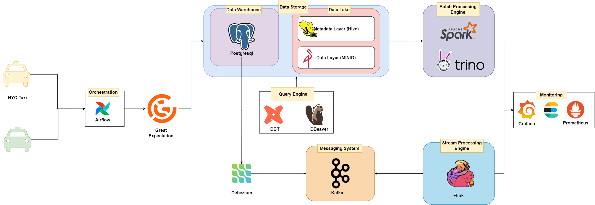
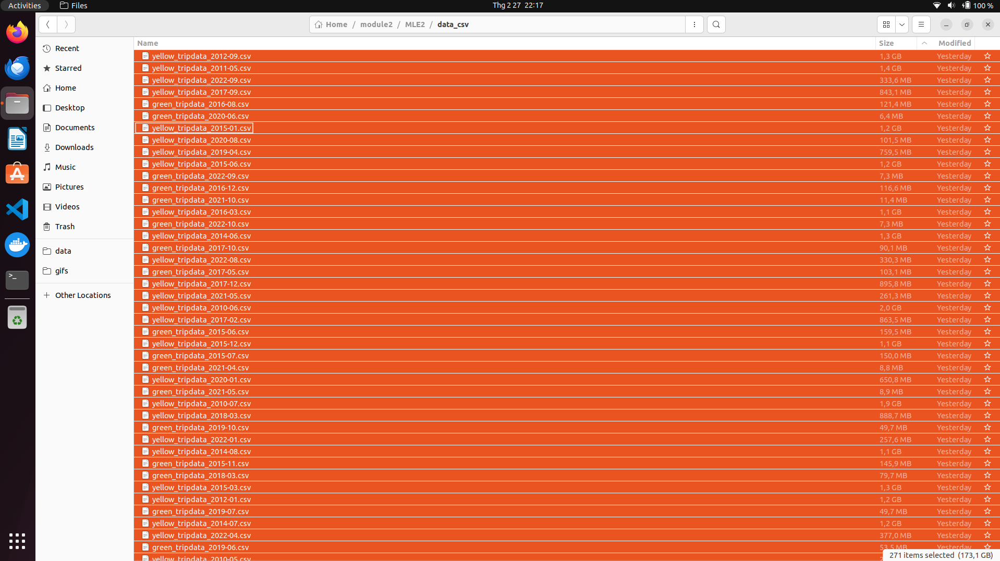
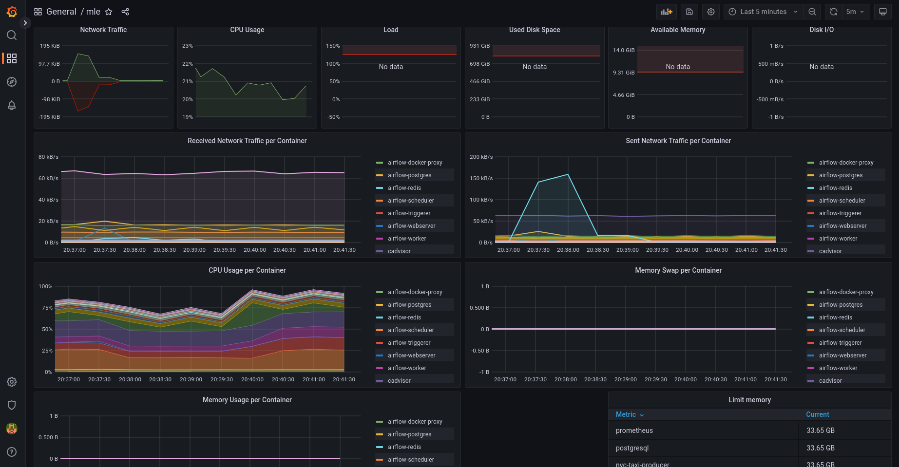
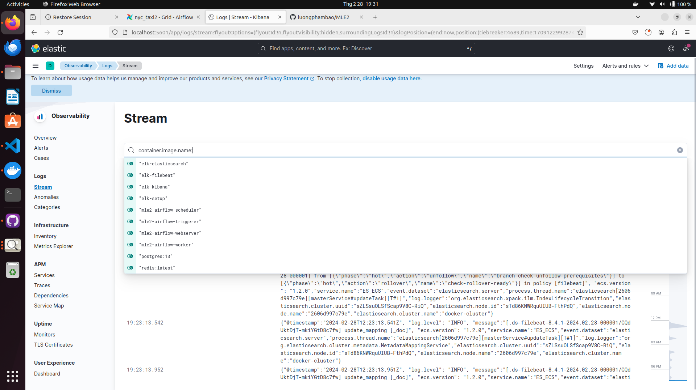
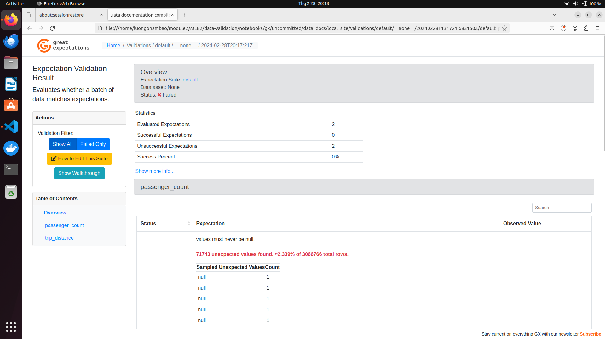
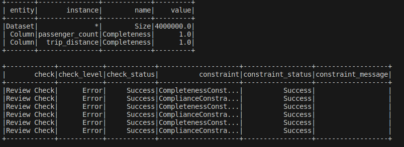

# nyc_taxi_feature_store
## Description 

+ In this repository, we develop and deploy a feature store system serving trip records from the Yellow and Green taxi fleets of the NYC Taxi and Limousine Commission (TLC). Various services are employed to meet the specific requirements of each stream. Pyspark, PostgreSQL, Flink, Kafka, DBT, and Airflow are among the prominent services utilized for these purposes. Additionally, monitoring tools such as Prometheus and Grafana are integrated to ensure effective performance monitoring.

## Overall data architecture




## Folder Structure
+ **stream_processing** folder: contain streaming data source and streaming processing service (kafka for data source and flink for processing)
+ **jars** folder: contain used jars file for data pipeline (Pyspark)
+ **airflow** folder: contain airflow dag,configuration,and deployment
+ **utils** folder: helper funtions
+ **pyspark** folder: contain scripts for batch processing
+ **ansible** folder: contain ansible playbook for deploying data pipeline, monitoring tools, and airflow on Google Compute Engine
+ **monitoring** folder: contain configuration for monitoring tools (Prometheus, Grafana)
+ **data** folder: contain data raw and streaming data
+ **data-validation** folder: contain great_expectations for data validation
+ **dbt_nyc** folder: contain dbt project for data transformation nyctaxi data
+ **src** folder: contain source code for data pipeline
+ **This repo is implemented on 170GB nyc taxi data**


## Installation
+ Tested on Python 3.9.12 (recommended to use a virtual environment such as Conda)
 ```bash
    conda create -n mle python=3.9
    pip install -r requirements.txt
 ```

+ Data: You can dowload and use this dataset in here: https://www.nyc.gov/site/tlc/about/tlc-trip-record-data.page. The format data I used in this Project is parquet/csv file

+ Docker engine
## Guide

+ You can use list command in `Makefile` to run service

+ For example: Run all service by command ```make run_all```
 ### Monitoring 
 You can run monitoring service by commands 
 ``` bash
 make monitoring_up
 make elk_up
 ```
 ### Access services
 Access at http://localhost:3000/ to for Grafana for tracking resource usage (`username/password` is `admin/admin`)
  
 Access at http://localhost:5601/ to for Kibana for tracking logs (`username/password` is `elastic/changeme`)
  
### Datalake-Minio
 You can see `datalake/README.MD` for details guide (setup,srcipts,...)
### Data Transformation DBT
 You can see `dbt_nyc/README.MD` for details guide (setup,srcipts,...)  
### Airflow
 You can see `airflow/README.MD` for details guide (setup,srcipts,...)
### Streamming Processing
 You can see `stream_processing/README.MD` for details guide (setup,srcipts,...)
### Data Validation
  **Great Expectations**:

You can find examples of data validation using Great Expectations in the `notebooks` folder `full_flow.ipynb` and `reload_and_validate.ipynb`.

Great Expectations is a Python-based library that allows you to define, manage, and validate expectations about data in your data pipelines and projects.


  **Deequ**:

You can explore data validation using Deequ in the file `pyspark/validation.py`.

Deequ is a library primarily built for Spark that enables data validation and quality checks within Spark data processing pipelines.

 
### Batch processing

+ Pyspark helps efficiently handle big data, speeding up data reading and writing, and processing much faster as data grows.

+ In this problem, we leverage Pyspark to transform and store data into a data warehouse, as well as quickly validate data.
#### How to guide

+ ``` python pyspark/batch_processing.py  #loading data from PostgreSQL```  
+ ``` python pyspark/parquet2warehouse.py      #write data from parquet to warehouse```
+ ``` python pyspark/datalake2warehouse.py      #write data from datalake to warehouse```
+ ``` python pyspark/validation.py        #validation data ```


 